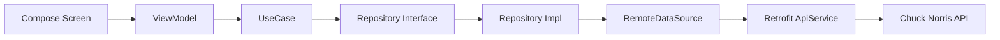

# ChuckNorrisApi

Aplicación Android construida con **Jetpack Compose + MVVM + Clean Architecture + Hilt + Retrofit + Coroutines + Moshi** para practicar consumo de APIs públicas sin autenticación.

Este proyecto está diseñado con enfoque **pedagógico**: no solo funciona, también sirve para aprender arquitectura escalable y principios SOLID.

## 1) Objetivo del proyecto

1. Consumir servicios HTTP reales de [Chuck Norris API](https://api.chucknorris.io/).
2. Separar responsabilidades por capas (`data`, `domain`, `presentation`).
3. Aplicar inyección de dependencias con Hilt.
4. Entender por qué cada clase existe y dónde debe vivir.
5. Dejar base preparada para crecer a proyectos más grandes.

---

## 2) Stack tecnológico

- **UI**: Jetpack Compose + Material3
- **Arquitectura**: MVVM + Clean Architecture (por feature)
- **Concurrencia**: Kotlin Coroutines + StateFlow
- **Networking**: Retrofit + OkHttp
- **Parsing JSON**: Moshi (codegen con KSP)
- **DI**: Hilt

---

## 3) Endpoints consumidos

Base URL:

```txt
https://api.chucknorris.io/
```

Servicios:

1. `GET /jokes/random`
2. `GET /jokes/random?category={category}`
3. `GET /jokes/categories`
4. `GET /jokes/search?query={query}`
5. `GET /jokes/{id}`

---

## 4) Arquitectura aplicada (visión general)



### ¿Por qué esta estructura?

1. **UI (Compose)** solo renderiza estado y dispara eventos.
2. **ViewModel** coordina acciones y transforma resultados en `UiState`.
3. **UseCase** encapsula intención de negocio (una acción por clase).
4. **Repository** abstrae origen de datos (hoy remoto, mañana remoto + local).
5. **DataSource/API** ejecuta llamadas HTTP.

---

## 5) Estructura del proyecto (rutas relativas)

```text
app/src/main/java/com/example/chucknorrisapi
├── ChuckNorrisApplication.kt
├── MainActivity.kt
├── core
│   └── di
│       ├── DispatchersModule.kt
│       ├── NetworkModule.kt
│       └── RepositoryModule.kt
├── feature
│   └── jokes
│       ├── data
│       │   ├── mapper
│       │   │   └── JokeMapper.kt
│       │   └── remote
│       │       ├── JokeRemoteDataSource.kt
│       │       └── api
│       │           ├── ChuckNorrisApiService.kt
│       │           └── dto
│       │               ├── JokeDto.kt
│       │               └── SearchJokesResponseDto.kt
│       ├── domain
│       │   ├── model
│       │   │   └── Joke.kt
│       │   ├── repository
│       │   │   ├── JokesRepository.kt
│       │   │   └── JokesRepositoryImpl.kt
│       │   └── usecase
│       │       ├── GetCategoriesUseCase.kt
│       │       ├── GetRandomJokesUseCase.kt
│       │       └── SearchJokesUseCase.kt
│       └── presentation
│           ├── JokesScreen.kt
│           ├── JokesUiState.kt
│           └── JokesViewModel.kt
└── ui/theme
```

> Nota: `JokesRepositoryImpl.kt` actualmente está ubicado en `domain/repository`. En una separación estricta, conviene moverlo a `data/repository`.

---

## 6) Archivo por archivo (qué hace y por qué existe)

| Ruta relativa | Responsabilidad | Teoría detrás |
|---|---|---|
| `ChuckNorrisApplication.kt` | Inicializar Hilt con `@HiltAndroidApp` | Punto de entrada del contenedor DI |
| `MainActivity.kt` | Host de Compose y entrada visual | Activity mínima, la lógica vive en ViewModel |
| `core/di/DispatchersModule.kt` | Proveer `CoroutineDispatcher` por DI (`IO`) | Testabilidad y desacoplamiento de hilos |
| `core/di/NetworkModule.kt` | Construir `OkHttp`, `Moshi`, `Retrofit`, `ApiService` | Configuración de red centralizada y reusable |
| `core/di/RepositoryModule.kt` | Bind interfaz-repositorio con Hilt | DIP: dependes de abstracciones |
| `feature/jokes/data/remote/api/ChuckNorrisApiService.kt` | Contrato HTTP | Retrofit tipado: `@GET`, `@Query`, `@Path` |
| `feature/jokes/data/remote/api/dto/*.kt` | Modelos exactos de respuesta JSON | DTO desacopla API externa de dominio interno |
| `feature/jokes/data/mapper/JokeMapper.kt` | Convertir DTO -> Domain | Evita propagar formato remoto a UI |
| `feature/jokes/data/remote/JokeRemoteDataSource.kt` | Encapsular llamadas remotas | SRP: acceso a red en un único punto |
| `feature/jokes/domain/model/Joke.kt` | Modelo de negocio | Dominio no depende de frameworks |
| `feature/jokes/domain/repository/JokesRepository.kt` | Contrato de datos para dominio | DIP + Interface Segregation |
| `feature/jokes/domain/repository/JokesRepositoryImpl.kt` | Implementación real del contrato | Orquesta red + mapper + error handling |
| `feature/jokes/domain/usecase/*.kt` | Casos de uso de negocio | Una acción por caso de uso (SRP) |
| `feature/jokes/presentation/JokesUiState.kt` | Estado único de la pantalla | UDF: renderizar en función del estado |
| `feature/jokes/presentation/JokesViewModel.kt` | Orquestar eventos, estado y reglas UI | MVVM puro: UI sin lógica de negocio |
| `feature/jokes/presentation/JokesScreen.kt` | Render de componentes Compose | Stateless UI + callbacks al ViewModel |

---

## 7) Principios SOLID en este proyecto

1. **S (Single Responsibility)**
   - Cada clase tiene una razón concreta para cambiar.
   - Ejemplo: `JokeRemoteDataSource` solo hace acceso remoto.

2. **O (Open/Closed)**
   - Puedes agregar nuevos casos de uso sin romper los existentes.
   - Ejemplo: crear `GetJokeByIdUseCase` sin tocar `JokesViewModel` base.

3. **L (Liskov Substitution)**
   - `JokesRepositoryImpl` sustituye a `JokesRepository`.

4. **I (Interface Segregation)**
   - El repositorio expone solo operaciones necesarias de la feature.

5. **D (Dependency Inversion)**
   - `ViewModel` depende de `UseCase/Repository` (abstracciones), no de Retrofit.

---

## 8) Flujo de una acción real

Ejemplo: usuario toca “Random Joke”.

1. `JokesScreen` dispara callback `onRefreshClick`.
2. `JokesViewModel.loadRandomJoke()` actualiza `isLoading=true`.
3. `GetRandomJokesUseCase` delega en `JokesRepository`.
4. `JokesRepositoryImpl` llama `JokeRemoteDataSource`.
5. `ApiService` consume `/jokes/random`.
6. DTO se mapea a `Joke` de dominio.
7. `ViewModel` publica nuevo `uiState`.
8. Compose recompone la UI con el resultado.

---

## 9) Configuración local y ejecución

### Requisitos

1. Android Studio reciente (Koala+ recomendado)
2. JDK 11
3. SDK Android instalado

### Ejecutar en local

```bash
./gradlew :app:assembleDebug
```

Si compila, puedes ejecutar desde Android Studio en emulador o dispositivo físico.

---

## 10) Troubleshooting rápido

### Error: `Unresolved reference: ksp`

Causas:
1. Falta plugin `ksp` en `app/build.gradle.kts`.
2. Falta plugin `ksp` en root `build.gradle.kts` con `apply false`.

### Error Hilt `error.NonExistentClass`

Causas comunes:
1. Tipo de retorno no resuelto en módulos DI.
2. Import incorrecto en `NetworkModule`/`RepositoryModule`.
3. Clase movida de paquete y no se actualizó import.

### Error de converter Moshi

Debe ser:

```kotlin
.addConverterFactory(MoshiConverterFactory.create(moshi))
```

No:

```kotlin
.addConverterFactory(Moshi)
```

---

## 11) Guía para agregar un nuevo servicio

Supongamos que quieres consumir otro endpoint.

1. Agrega método en `ChuckNorrisApiService`.
2. Crea/ajusta DTO en `data/remote/api/dto`.
3. Crea mapper DTO -> Domain.
4. Agrega método en `JokesRepository`.
5. Implementa método en `JokesRepositoryImpl`.
6. Crea UseCase específico.
7. Usa el UseCase desde ViewModel.
8. Refleja resultado en `JokesUiState` y `JokesScreen`.

Orden recomendado: siempre de **data -> domain -> presentation**.

---

## 12) Estado actual del proyecto

- Proyecto compila con `:app:assembleDebug`.
- Base funcional para random, categorías y búsqueda.
- Arquitectura lista para crecer por feature.

Mejoras sugeridas de refactor:

1. Mover `JokesRepositoryImpl` a `feature/jokes/data/repository`.
2. Eliminar imports no usados y `Log` de debug innecesario en ViewModel.
3. Eliminar archivos `.DS_Store` dentro de `src/main/java`.
4. Añadir tests unitarios de mapper, use cases y viewmodel.

---

## 13) Comandos útiles

```bash
# Compilar debug
./gradlew :app:assembleDebug

# Ejecutar tests unitarios
./gradlew :app:testDebugUnitTest

# Limpiar build
./gradlew clean
```

---

## 14) Próximos pasos de aprendizaje

1. Añadir pantalla de detalle por `id`.
2. Implementar navegación con `NavHost` y rutas tipadas.
3. Introducir capa local (Room/DataStore) para favoritos.
4. Añadir `sealed class UiEvent` para eventos one-shot.
5. Migrar a multi-módulo (`core:network`, `feature:jokes`, `app`) cuando crezca el proyecto.

---

## 15) Licencia

Proyecto educativo para práctica de arquitectura Android.
